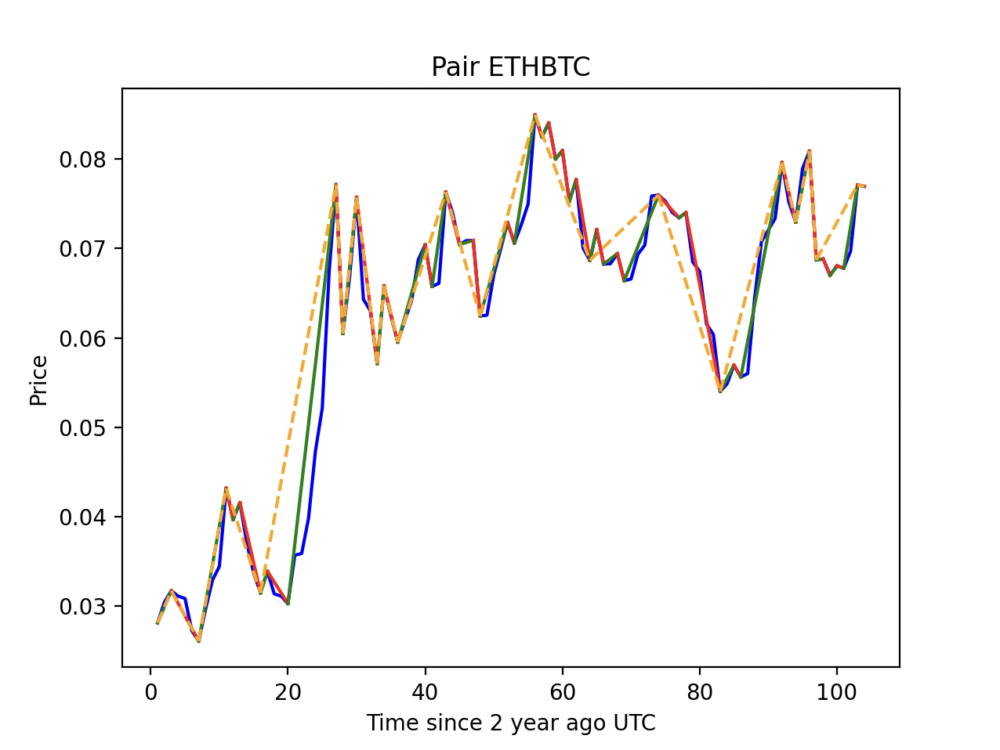

# Clear chart

Clear chart is a Python script allowing to show a synthetic and clearer version graph of a crypto currency pair from Binance:




There is still a lot to be done, it is experimental code.

## Installation

To run the script, first ensure that you have [Python3.x](https://www.python.org/) installed.

After that, you can donwload the repository and move into it:

```sh
$ git clone git@github.com:akhercha/clear-chart.git
$ cd clear-chart
```

Create a virtual environment to install dependencies in and activate it:

```sh
$ python3 -m venv venv
$ source venv/bin/activate
```

Use the package manager [pip](https://pip.pypa.io/en/stable/) to install required packages.

```sh
$ pip install -r requirements.txt
```

Before going further, you now need to specify your read only API keys from Binance in a `.env` file located at the root of the project. It will contains two variables, `BINANCE_API_KEY` and `BINANCE_API_SECRET`:

```sh
# .env
BINANCE_API_KEY=XIO...az
BINANCE_API_SECRET=ABX..pP
```

## Usage

```sh
# Will show the chart of Sushi.
python main.py SUSHIUSDT
```
